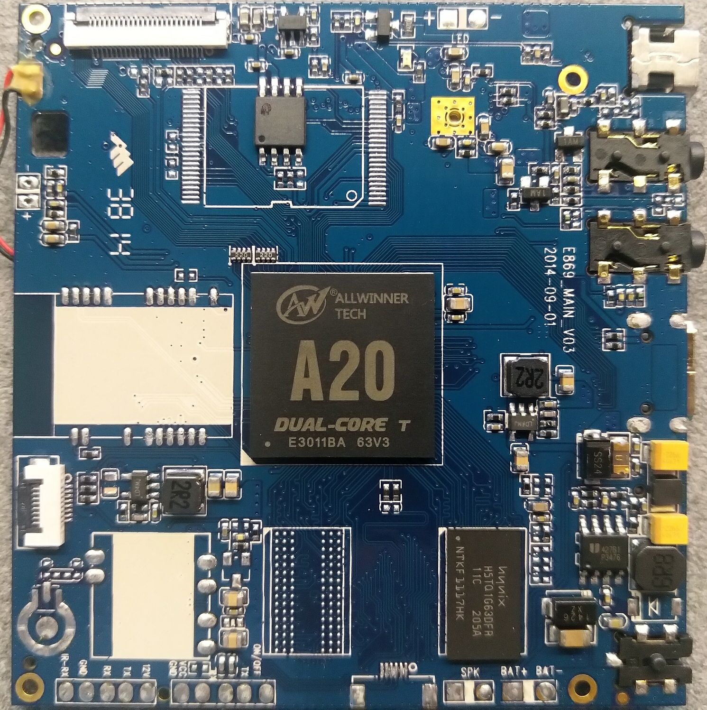
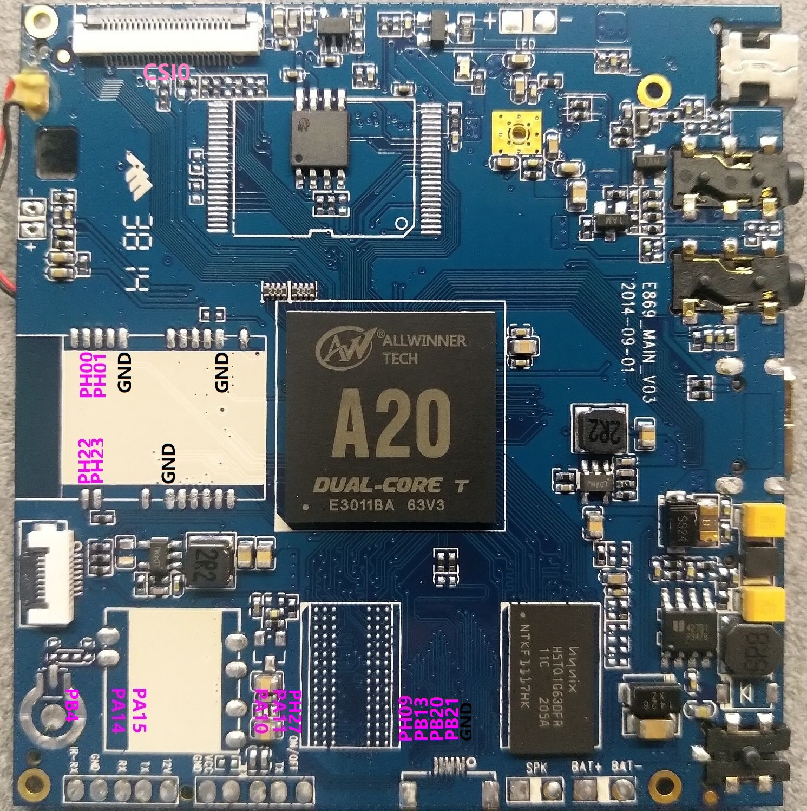

# sun7i-std-dvr

This repository contains information and mainline related sources of a CDR board based on AllWinner's A20(sun7i) SoC.

## Repository Layout
* doc/  Documentation and datasheet
* img/  Images
* src/  Source codes

## Board Information
### Hardware Configuration
* SoC: AllWinner A20(sun7i) Dual-core Arm Cortex-A7
* RAM: 128MB 32bit@480MHz [H5TQ1G63DFR-11C](https://html.alldatasheet.com/html-pdf/534215/HYNIX/H5TQ1G63DFR-11C/650/4/H5TQ1G63DFR-11C.html)
* ROM: 8M SPI flash w25q64
* PMU: AXP209
* Accelerometer: [lis3dh](https://www.st.com/en/mems-and-sensors/lis3dh.html?icmp=pf250725_pron_pr_feb2014&sc=lis3dh-pr)

### Pinout
(WIP)

Currently explored available peripherals:
* 1xlcd/lvds port (lcd0)
* 1xcsi port, with 1xi2c embedded (csi0, i2c)
* 1xusb otg (usb0)
* 1xi2c (i2c2)
* 1xnand (nand0)
* 4xUART (uart0, uart1, uart3, uart7)

### Schematic
There is no actual schematic for this board found yet. However, there is a schematic for another CDR solution designed by AllWinner available at doc/. Nevertheless that board shares many similarities with this one, some significant differences are already observed. Take that as a reference at your own risk.

## Mainline Build Instructions
(WIP)