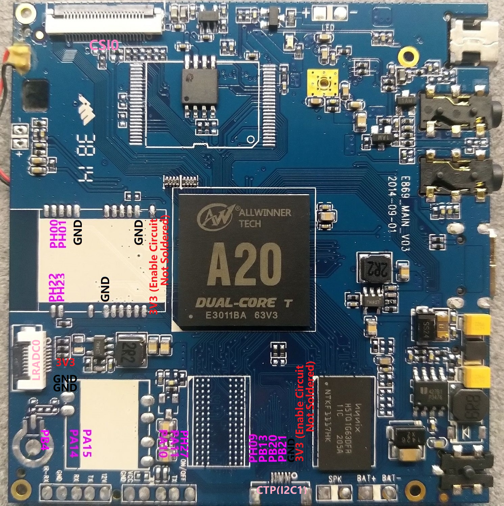

# sun7i-std-dvr

This repository contains information and mainline related sources of a CDR board based on AllWinner's A20(sun7i) SoC.

## Repository Layout
* [doc/](https://github.com/SdtElectronics/sun7i-std-dvr/tree/master/doc)  Documentation and datasheet
* [img/](https://github.com/SdtElectronics/sun7i-std-dvr/tree/master/img)  Images
* [src/](https://github.com/SdtElectronics/sun7i-std-dvr/tree/master/src)  Source codes

## Board Information
### Hardware Configuration
* SoC: AllWinner A20(sun7i) Dual-core Arm Cortex-A7
* RAM: 128MB 16bit@480MHz [H5TQ1G63DFR-11C](https://html.alldatasheet.com/html-pdf/534215/HYNIX/H5TQ1G63DFR-11C/650/4/H5TQ1G63DFR-11C.html)
* ROM: 8M SPI flash w25q64
* PMU: AXP209
* Accelerometer: [lis3dh](https://www.st.com/en/mems-and-sensors/lis3dh.html?icmp=pf250725_pron_pr_feb2014&sc=lis3dh-pr)

### Pinout
(WIP)

Currently explored available peripherals:
* 1xlcd/lvds port (lcd0)
* 1xcsi port, with 1xi2c embedded (csi0, i2c1)
* 1xusb otg (usb0)
* 1xi2c (i2c2)
* 1xnand (nand0)
* 4xUART (uart0, uart1, uart3, uart7)

### Schematic
There is no actual schematic for this board found yet. However, there is a schematic for another CDR solution designed by AllWinner available at [doc/A20-CDR-V0-2-20150312.pdf](doc/A20-CDR-V0-2-20150312.pdf). Nevertheless that board shares many similarities with this one, some significant differences are already observed. Take that as a reference at your own risk.

## Mainline Build Instructions
(WIP)

## Peripherals Instructions
### LCD
There is a standard 40pin parallel RGB lcd port on board, connected to panel controller lcd0 on chip. For instructions about driving lcds, please refer to [LCD](doc/lcd.md).

### HDMI
There is a mini-HDMI port on board. HDMI support is enabled in both u-boot and kernel by default with configurations provided by this repository. 

### USB Gadget (Peripheral Mode)
USB0 in A20 SoC features a dual-role controller thus can be operated in both host and peripheral mode. However, the mini-USB port on board attached to USB0 did not wire cd pin to the chip, so the otg functionality is not supported. You have to specify the role of USB0 manually in the device-tree file or switch it in procfs. All of the device-tree files in this repository set USB0 to peripheral mode by default.

With the USB gadget support in kernel, this board can be emulated as a variety of devices, which enables fast and convenient communication between this board and a PC. Guides on emulating this board as some devices via configfs are listed below:

* #### [Ethernet Gadget (RNDIS Net Adapter)](doc/RNDIS.md)
    Board can be recognized as a net adapter and share network with PC
* #### Serial Gadget
    (WIP)
* #### Mass Storage
    (WIP)
